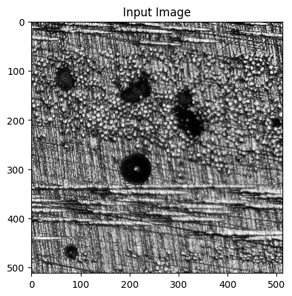
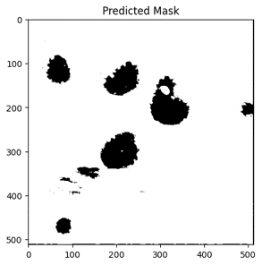

# Pore-estimation

This code was developed to estimate porosity levels in light microscopy images using machine learning. The first step is to crop the images so that the size of the images is universal (512 x 512 px). Afterwards, the mask of the pores as images was generated usign the annotation file output from CVAT.ai. Afterwards the training and testing datasets are defined accordingly. The deep learning model is then implemented using U-Net as the CNN architecture. 

 |  > 
